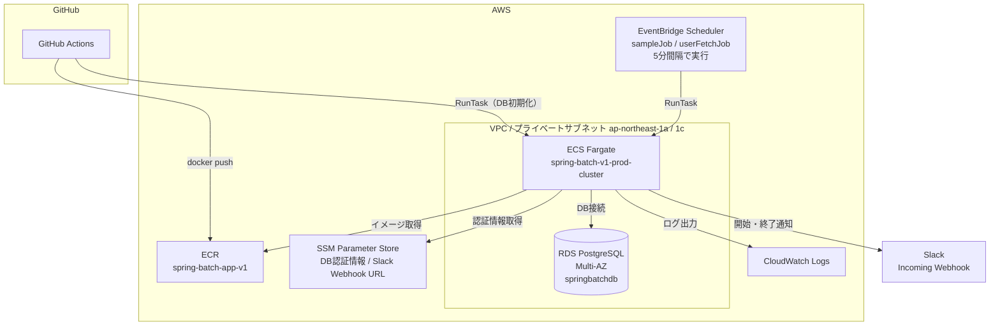

# インフラ構成（Terraform）

Spring Batch アプリケーション（`apps/spring-batch-app-v1`）を AWS 上で定期実行するためのインフラを Terraform で管理します。
リポジトリ全体の構成は [ルートREADME](../README.md) を参照してください。

---

## ディレクトリ構成

```
infra/
├── common/                          # 共有インフラ（VPC・RDS・IAMなど）
│   ├── env/prod/                    # prod環境エントリーポイント
│   │   └── bootstrap/               # Terraformバックエンド（S3）初期構築用
│   └── modules/
│       ├── iam/                     # OIDC Provider（GitHub Actions用）
│       ├── rds/                     # RDS PostgreSQL（Multi-AZ）
│       ├── s3/                      # S3バケット
│       ├── ssm_parameter/           # SSM Parameter Store（RDS認証情報・Slack Webhook URL）
│       └── vpc/                     # VPC・サブネット・NAT・Bastion
│
└── individual/                      # アプリ個別インフラ（ECR・ECS・EventBridgeなど）
    ├── env/prod/                    # prod環境エントリーポイント
    └── modules/
        ├── ecr/                     # ECRリポジトリ（spring-batch-app-v1）
        ├── ecs/                     # ECSクラスタ・タスク定義・IAMロール・SG
        ├── eventbridge/             # EventBridge Schedulerによる定期実行
        └── iam/                     # GitHub Actions用IAMロール（ECRプッシュ・ECS単発タスク実行権限）
```

---

## アーキテクチャ概要



GitHub Actions は、GitHub Environments（`prod`）を使った OIDC 認証で IAM ロールを引き受けます。
詳細は [ルートREADME](../README.md) の「CI/CD」を参照してください。

---

## Terraformスタック構成

本リポジトリは **2つの独立したTerraformスタック**で管理されています。

| スタック | ディレクトリ | 用途 |
|---|---|---|
| common | `common/env/prod/` | VPC・RDS・S3など共有インフラ |
| individual | `individual/env/prod/` | ECR・ECS・EventBridgeなどアプリ個別インフラ |

`individual` スタックは `common` スタックのリソースを AWS データソースで参照します。

---

## 主要リソース

### common スタック

| リソース | 内容 |
|---|---|
| VPC | `10.0.0.0/16`、パブリック×2 / プライベート×2（ap-northeast-1a, 1c） |
| NAT Gateway | パブリックサブネットに配置 |
| Bastion | パブリックサブネットに配置（SSH踏み台） |
| RDS PostgreSQL | `db.t3.micro`、Multi-AZ、暗号化有効、`springbatchdb` |
| SSM Parameter Store | RDS認証情報（`/spring-batch-v1/prod/rds/username`, `password`）とSlack Webhook URL（`/spring-batch-v1/prod/slack/webhook_url`）。`bootstrap` で作成し、値は初回作成後にConsoleやCLIで更新する |

### individual スタック

| リソース | 内容 |
|---|---|
| ECR | `spring-batch-v1-prod-spring-batch-app-v1`（最新30イメージ保持） |
| ECS クラスタ | `spring-batch-v1-prod-cluster`（Fargate、Container Insights有効） |
| ECS タスク定義 | `spring-batch-v1-prod-spring-batch`（CPU: 512、Memory: 1024） |
| EventBridge Scheduler | `sampleJob`・`userFetchJob` を5分間隔で実行（`batch_schedule_state` で停止可能） |
| IAM（GitHub Actions） | OIDC経由（Environment `prod` のジョブのみ許可）で、ECRプッシュ権限と、ECS単発タスクの起動・確認権限（DB初期化用）を付与 |

---

## 定期実行の停止・再開

EventBridge Scheduler の状態は、`infra/individual/env/prod/terraform.tfvars` の `batch_schedule_state` で切り替えます。

| 値 | 動作 |
|---|---|
| `ENABLED` | `sampleJob`・`userFetchJob` を5分間隔で実行する |
| `DISABLED` | 定期実行を停止する（現在の設定） |

```bash
cd infra/individual/env/prod
terraform apply   # tfvars の値を変更してから実行
```

---

## Spring Batch ジョブ一覧

| ジョブ名 | 概要 |
|---|---|
| `sampleJob` | 基本サンプルジョブ |
| `sampleContinuingJob` | 継続処理サンプルジョブ |
| `parallelJob` | 並列処理ジョブ |
| `productFetchJob` | RDSからProduct情報を取得 |
| `userFetchJob` | RDSからUser情報を取得 |

---

## Terraform 操作手順

### 初回セットアップ

```bash
# バックエンド（S3）の初期構築
cd infra/common/env/prod/bootstrap
terraform init && terraform apply

# common スタック
cd infra/common/env/prod
terraform init && terraform apply

# individual スタック
cd infra/individual/env/prod
terraform init && terraform apply
```

### 通常のapply

```bash
cd infra/common/env/prod      # または infra/individual/env/prod
terraform plan
terraform apply
```

---

## ECS タスクの手動実行

```bash
aws ecs run-task \
  --cluster spring-batch-v1-prod-cluster \
  --task-definition spring-batch-v1-prod-spring-batch \
  --launch-type FARGATE \
  --network-configuration "awsvpcConfiguration={subnets=[subnet-xxxx,subnet-yyyy],securityGroups=[sg-xxxx],assignPublicIp=DISABLED}" \
  --overrides '{"containerOverrides":[{"name":"spring-batch-app","environment":[{"name":"JOB_NAME","value":"productFetchJob"}]}]}'
```

サブネットID・SGIDは以下で確認できます。

```bash
cd infra/individual/env/prod
terraform output ecs_private_subnet_ids
terraform output ecs_task_security_group_id
```

---

## ローカル開発

```bash
cd apps/spring-batch-app-v1   # monorepoルートから

# PostgreSQL 起動
docker compose up -d postgres

# バッチ実行（ジョブ名を指定）
JOB_NAME=productFetchJob docker compose up batch-app
```

ローカルDB接続情報：

| 項目 | 値 |
|---|---|
| Host | `localhost` |
| Port | `5432` |
| Database | `batchdb` |
| Username | `batchuser` |
| Password | `batchpass` |
